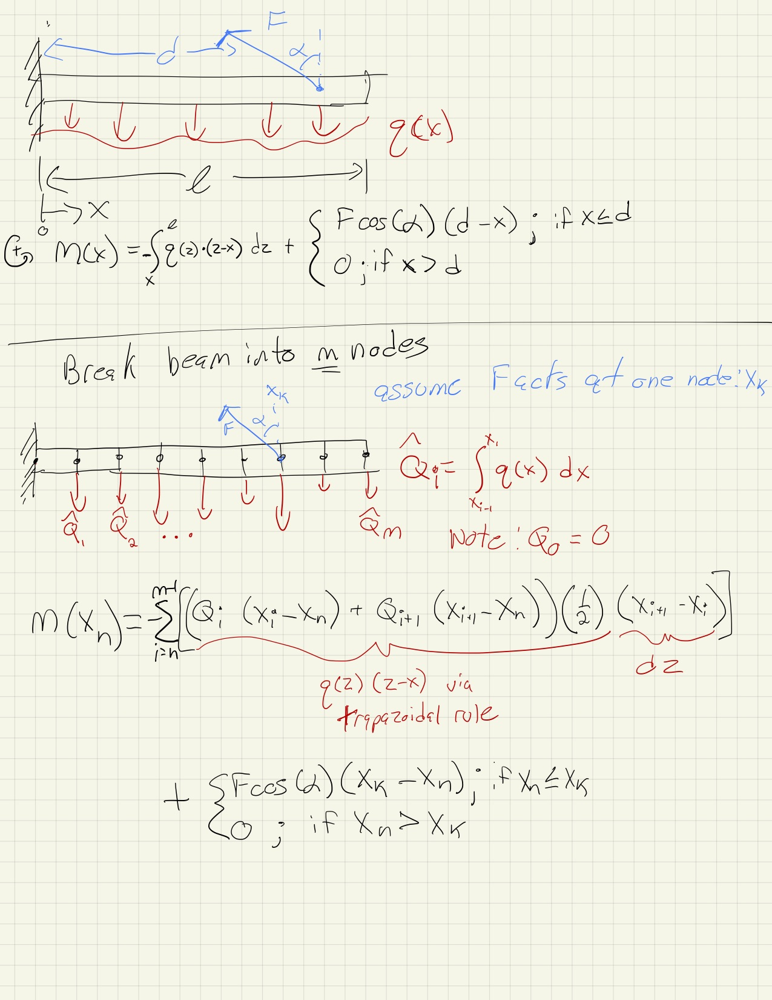

# Goals of the lecture
This lecture covers the process of differentiating a moderately complex component with vector inputs and vector outputs. 
The complexity arises because the relationship between the inputs and outputs is more than an simple element by element vectorization. 

This means that the Jacobian includes off-diagonal terms which make the sparsity more complex than a simple diagonal matrix. 
We'll start by using dense partial derivatives, then transition to the more advanced sparse partials. 

# Beam in Bending
We'll calculate the bending moment along a cantilevered beam under both distributed and point loading. 
The calculations are discretized and implemented in a for-loop fashion. 
You'll see how the derivative code structure mimics the for-loop structure from the analysis itself

